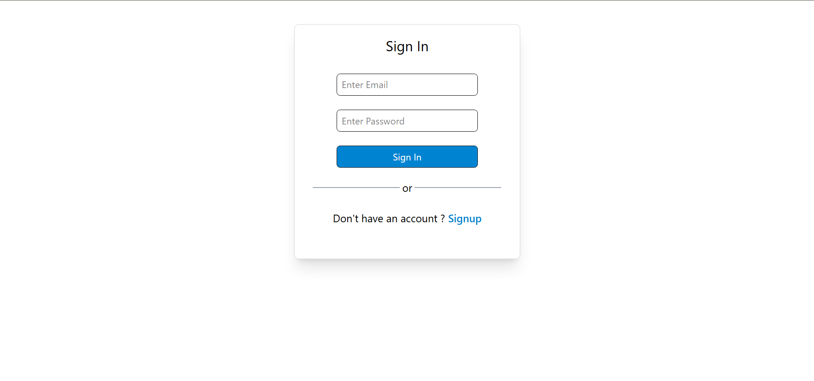
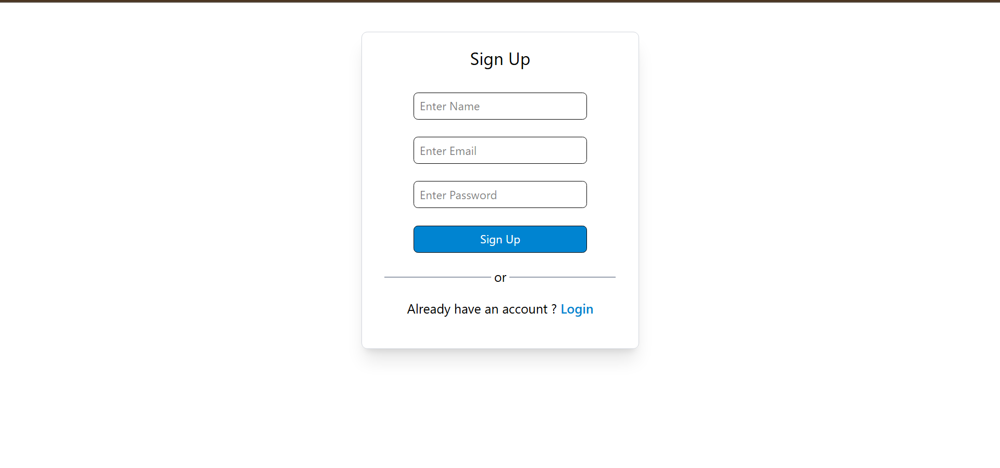
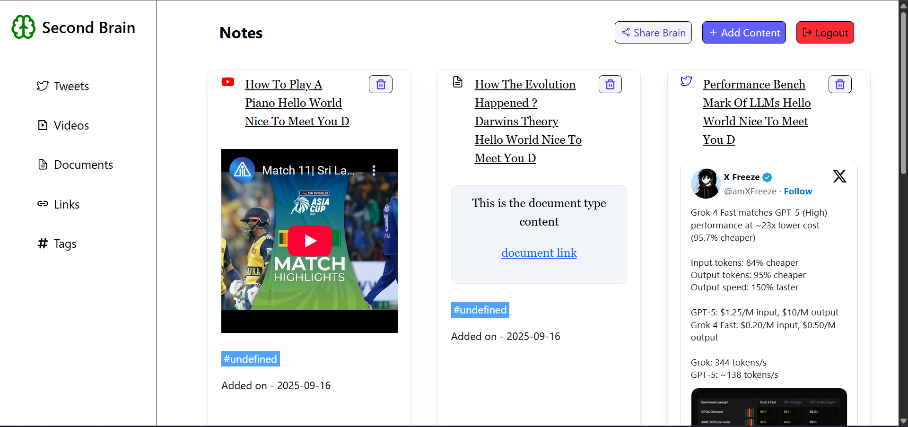
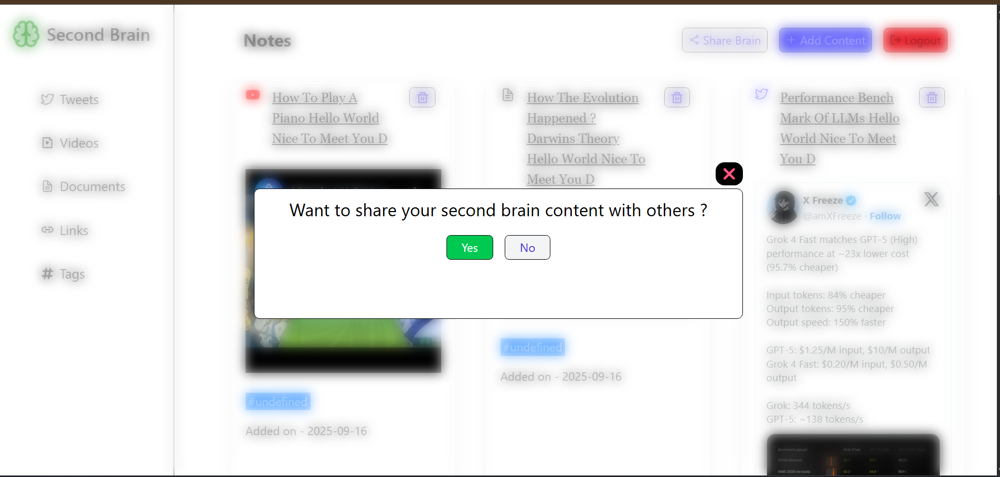
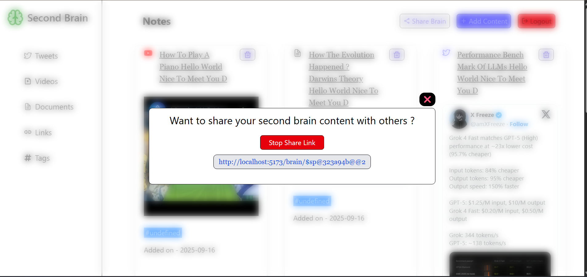

# 🧠 Brainly – Second Brain Application

Brainly is a **Second Brain application** built with the **MERN stack** and **TypeScript** on both the frontend and backend.  
It helps users capture, organize, and share their knowledge easily.  

---

## 🚀 Features

- **Authentication**
  - 🔐 Sign up & Sign in pages with validation
  - ❌ Logout button clears the JWT token from `localStorage`
  - ⚠️ Error page for invalid routes or API errors

- **Content Management**
  - ➕ Add Content button opens a modal
  - Choose **content type** (e.g., Note, Link, Article, Video, etc.)
  - Add **title, link, and tags**
  - All content saved securely per user

- **Sharing Knowledge**
  - 🔗 Share button opens a modal
  - Generates a **public link** to share Second Brain content
  - Users can **stop sharing anytime**, making the link inaccessible
  - Public viewers can see the shared content without authentication

- **UI**
  - Clean modal-based UX for adding and sharing content
  - Responsive design

---

## 🛠️ Tech Stack

**Frontend**  
-  React (with TypeScript)  
-  Tailwind (optional, depending on your setup)  
-  LocalStorage for JWT persistence  

**Backend**  
-  Node.js + Express (with TypeScript)  
-  MongoDB + Mongoose  
-  JWT Authentication  
-  REST APIs  

## Screenshots

### Sign In Page

### Sign Up Page

### 🏠 Dashboard

### 🔗 Share Modal

### Share Link

### Add Content Modal

### Project GIF

