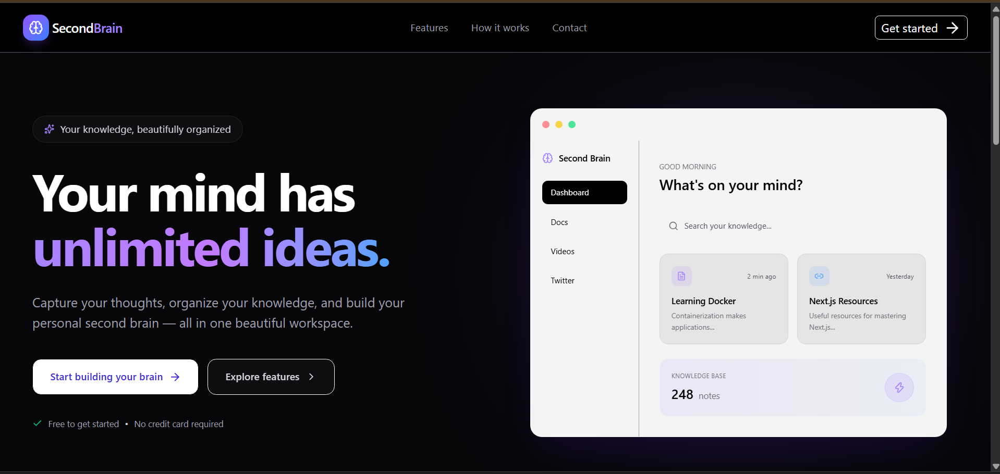
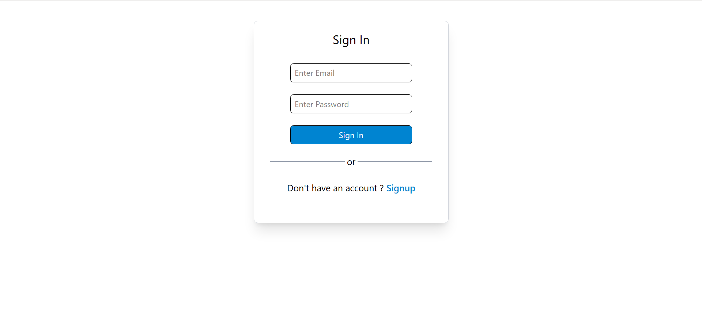
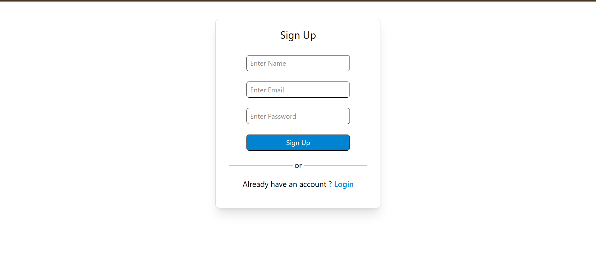
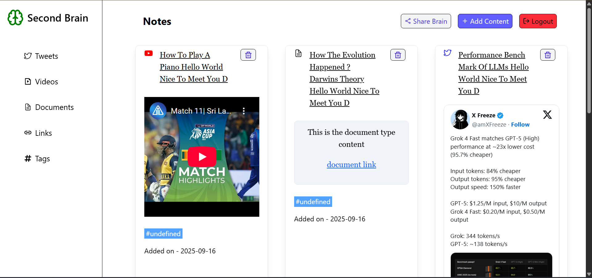
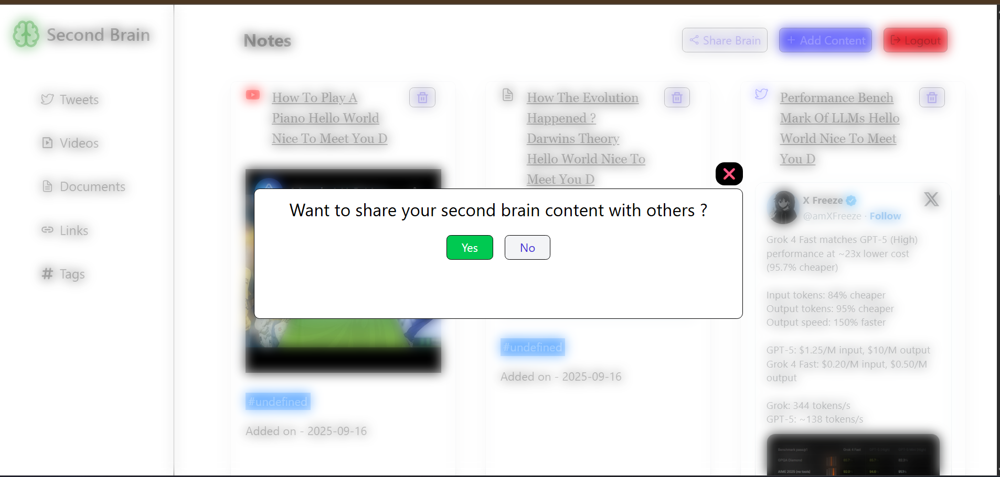
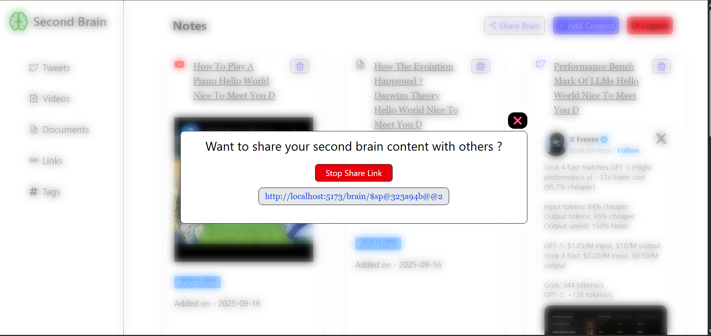
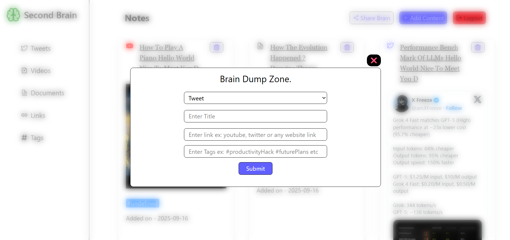
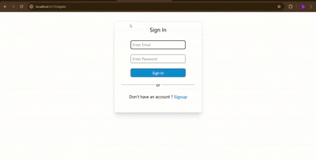

# 🧠 Brainly – Second Brain Application

Brainly is a **Second Brain application** that helps users capture, organize, search, manage, and share their knowledge in one place.

The application is built using **React, Node.js, Express, TypeScript, and MongoDB**. The project is fully containerized using **Docker and Docker Compose** for development and uses **GitHub Actions CI/CD** for automated deployment to an **AWS EC2 production server**.

---

## ✨ Features

### 🔐 Authentication

- User Sign Up and Sign In
- Frontend form validation
- Backend request validation using **Zod**
- JWT-based authentication
- Protected routes
- Logout functionality
- Authentication and API error handling

### 🧠 Content Management

- Create and manage personal knowledge
- Add different types of content:
  - 🔗 Links
  - 📄 Documents
  - 🎥 YouTube videos
  - 💭 Brain thoughts
  - 🕊️ Tweet

- Add titles, links, and tags
- Backend validation using **Zod**
- Content is securely stored for each user
- Delete existing content
- Each user's content is isolated from other users

### 🔎 Search & Pagination

- Search content inside your Second Brain using the **content title**
- Paginate through saved content
- Navigate between different pages of content
- Search results are also paginated
- Efficiently browse large collections of saved knowledge

### 🔗 Knowledge Sharing

- Generate a public link to share your Second Brain
- Share saved knowledge with other users
- Public viewers can access shared content without authentication
- Stop sharing at any time
- Shared links become inaccessible after sharing is disabled

### 🎨 Responsive UI

- Fully responsive design
- Works across desktop, tablet, and mobile devices
- Responsive sidebar and dashboard
- Modal-based interactions
- User-friendly error pages

### 🐳 Dockerized Development

The complete development environment is containerized using **Docker and Docker Compose**.

Start the entire development environment with a single command:

```bash
docker compose up -d
```

The development setup includes **live code updates** without manually rebuilding or restarting containers.

#### Frontend HMR

The React frontend uses **Vite Hot Module Replacement (HMR)**.

The source code is mounted into the frontend container using **Docker volumes**, allowing changes made on the host machine to be immediately detected inside the container.

```text
Host Machine
     │
     │ Docker Volume
     ▼
Frontend Container
     │
     ▼
Vite Development Server
     │
     ▼
Hot Module Replacement
     │
     ▼
Browser Updates Automatically
```

This means you can modify React components, styles, or other frontend code and see the changes reflected in the browser without manually rebuilding the Docker image.

#### Backend Hot Reloading

The backend development environment uses **Nodemon** together with **tsx** for automatically restarting the Node.js/TypeScript server when source files change.

```text
Host Machine
     │
     │ Docker Volume
     ▼
Backend Container
     │
     ▼
Nodemon
     │
     ▼
tsx
     │
     ▼
TypeScript Backend
     │
     ▼
Automatic Server Restart
```

This provides a development experience similar to running the frontend and backend directly on the host machine while keeping the entire development environment inside Docker containers.

> **Note:** Running docker inside wsl-2/windows sometimes OS is unable to send events to nodemon and vite inside the container then add polling in the nodemon and vite.

---

### 🚀 Automated Production Deployment

The project uses **GitHub Actions** for automated deployment to an **AWS EC2 production server**.

The production deployment follows this workflow:

```text
Developer
    │
    │ git push
    ▼
GitHub Repository
    │
    ▼
GitHub Actions
    │
    ├── Build Docker Image
    │
    ├── Push Docker Image to Docker Hub
    │
    └── SSH into AWS EC2
             │
             ▼
        Docker Pull
             │
             ▼
        Docker Container
             │
             ▼
           Nginx
             │
             ▼
        Production App
```

This automates the process of building and deploying new versions of the application.

---

# 🛠️ Tech Stack

### Frontend

- React
- TypeScript
- React Router
- Tailwind CSS
- Vite
- React Icons
- React Toastify
- Lucide React Icons

### Backend

- Node.js
- Express.js
- TypeScript
- REST APIs
- JWT Authentication
- Zod validation
- Nodemon
- tsx

### Database

- MongoDB
- Mongoose

### DevOps & Deployment

- Docker
- Docker Compose
- Docker Volumes
- Docker Hub
- GitHub Actions
- AWS EC2
- Nginx

---

# 🏗️ Application Architecture

The application uses Docker containers for the application services and Nginx as a reverse proxy in the production environment.

```text
                         Internet
                            │
                            ▼
                    ┌──────────────────┐
                    │      Nginx       │
                    │  Reverse Proxy   |
                    │   port: 80/443   |
                    └────────┬─────────┘
                             │
                    ┌────────┴────────┐
                    │                 │
                    ▼                 ▼
           ┌─────────────────┐ ┌─────────────────┐
           │ Frontend        │ │ Backend         │
           │ Docker          │ │ Docker          │
           │ Container       │ │ Container       │
           │ Nginx serves    │ │                 │
           │ dist/ files     │ │ Node + Express  │
           └─────────────────┘ └────────┬────────┘
                                       │
                                       ▼
                              ┌─────────────────┐
                              │     MongoDB     │
                              │     Database    │
                              └─────────────────┘
```

---

# 🐳 Running the Project Locally

## Prerequisites

Make sure you have the following installed:

- [Git](https://git-scm.com/)
- [Docker](https://www.docker.com/)
- Docker Compose

With the Docker setup, you do not need to manually install Node.js, MongoDB, or the project's dependencies on your local machine.

---

## 1. Clone the Repository

```bash
git clone https://github.com/Shivansh-Pandey-4/second-brain-app.git
```

Navigate into the project:

```bash
cd second-brain-app
```

---

## 2. Configure Environment Variables

The repository contains `.env.example` files for both the frontend and backend.

```text
frontend/
└── .env.example

backend/
└── .env.example
```

You can create your environment files manually based on these examples, or simply copy them:

```bash
cp backend/.env.example backend/.env
cp frontend/.env.example frontend/.env
```

Then update the required credential and configuration values inside the newly created `.env` files.

```text
backend/.env.example  →  backend/.env
frontend/.env.example →  frontend/.env
```

> **Note:** The `.env.example` files are provided as references. Only the required credential and environment-specific values need to be changed.

---

## 3. Start the Development Environment

Run:

```bash
docker compose up -d
```

This will build and start the required containers.

Check running containers:

```bash
docker compose ps
```

View logs:

```bash
docker compose logs
```

Follow logs in real time:

```bash
docker compose logs -f
```

---

## 4. Stop the Application

```bash
docker compose down
```

---

# 🔄 Development Workflow

The development environment is completely containerized using Docker Compose while still providing a live development experience.

```text
                         Docker Compose
                              │
              ┌───────────────┼───────────────┐
              │               │               │
              ▼               ▼               ▼
        ┌──────────┐    ┌──────────┐    ┌──────────┐
        │ Frontend │    │ Backend  │    │ MongoDB  │
        │Container │    │Container │    │Container │
        └────┬─────┘    └────┬─────┘    └──────────┘
             │               │
             │               │
        Docker Volume    Docker Volume
             │               │
             ▼               ▼
        Source Code      Source Code
             │               │
             ▼               ▼
          Vite + HMR     Nodemon + tsx
             │               │
             ▼               ▼
        Browser Update    Server Restart
```

Therefore, you can develop the application normally while the frontend and backend are running inside Docker containers.

---

# 🚀 Production Deployment

The production application runs on an **AWS EC2 instance**.

The project uses **GitHub Actions** to automate the complete deployment process.

## Deployment Flow

```text
Developer
    │
    │ git push
    ▼
GitHub Repository
    │
    ▼
GitHub Actions
    │
    ├─────────────────────────┐
    │                         │
    ▼                         ▼
Build Docker Image      Authenticate with
                         Docker Hub
    │
    ▼
Push Docker Image
to Docker Hub
    │
    ▼
SSH into AWS EC2
    │
    ▼
Pull Latest Docker Image
from Docker Hub
    │
    ▼
Stop / Replace Old Container
    │
    ▼
Run New Docker Container
    │
    ▼
        Nginx
    Reverse Proxy
    │
    ▼
Production Application
```

### Docker Image Registry

The built Docker images are pushed to **Docker Hub** during the CI/CD pipeline.

The EC2 server then pulls the required images from Docker Hub:

### SSH Deployment

After pushing the Docker image to Docker Hub, GitHub Actions connects to the EC2 server using **SSH**.

The deployment process on the EC2 server includes:

1. Connect to the EC2 instance through SSH.
2. Pull the latest Docker image from Docker Hub.
3. Stop/remove the previous application container.
4. Start a new container using the latest image.
5. Nginx routes incoming traffic to the appropriate application container.

---

# 🌐 Nginx Reverse Proxy

**Nginx** is used as a reverse proxy on the production EC2 server.

Instead of exposing the application containers directly to the internet, Nginx receives incoming HTTP requests and forwards them to the appropriate application container.

```text
                  User
                   │
                   │ HTTP Request
                   ▼
             ┌────────────┐
             │   Nginx    │
             │   :80      │
             └─────┬──────┘
                   │
          ┌────────┴─────────┐
          │                  │
          ▼                  ▼
     Frontend             Backend
     Container            Container
                              │
                              ▼
                           MongoDB
```

Nginx acts as the public entry point while the application containers run internally on the EC2 server.

---

# 📦 Docker

The project uses Docker in both **development and production**.

### Development

Docker Compose is used to start the complete development environment:

```bash
docker compose up -d
```

The development containers use Docker volumes to mount source code and support:

- Vite Hot Module Replacement (HMR) for the frontend
- Nodemon + tsx for backend hot reloading

### Production

Production Docker images are built through GitHub Actions and pushed to Docker Hub.

The EC2 server pulls those images and runs them as Docker containers.

---

# 📁 Project Structure

```text
second-brain-app/
│
├── .github/
│   └── workflows/
│       └── ... CI/CD workflows
│
├── backend/
│   ├── src/
│   ├── .env.example
│   ├── package.json
│   └── ...
│
├── frontend/
│   ├── public/
│   │   └── screenshots/
│   ├── src/
│   ├── .env.example
│   ├── package.json
│   └── ...
│
├── docker/
│   └── ...
│
├── docker-compose.yml
├── .dockerignore
├── README.md
└── ...
```

---

# 📸 Screenshots

## 🌐 Landing Page



## 🔐 Sign In Page



## 📝 Sign Up Page



## 🏠 Dashboard



## 🔗 Share Modal



## 🔗 Share Link



## ➕ Add Content Modal



---

# 🎥 Project Demo



---

# 📚 What I Learned

This project provided hands-on experience across **full-stack development, validation, containerization, CI/CD, and production deployment**.

### Frontend

- Building responsive React applications
- React component architecture
- Client-side routing
- Form handling and validation
- Authentication flows
- Search functionality
- Pagination
- Responsive UI design
- Vite development server
- Hot Module Replacement (HMR)

### Backend

- Building REST APIs with Express
- JWT-based authentication
- CRUD operations
- MongoDB and Mongoose
- Express middleware
- API error handling
- Request validation using Zod
- Search APIs
- Pagination
- Public and private resources
- Backend hot reloading with Nodemon and tsx

### Docker

- Writing Dockerfiles
- Containerizing frontend and backend applications
- Docker Compose
- Multi-container application development
- Docker volumes
- Container networking
- Environment variables
- Development containers
- Building production Docker images
- Docker image management
- Docker Hub

### CI/CD & Deployment

- GitHub Actions
- Automated CI/CD pipelines
- Building Docker images inside GitHub Actions
- Pushing Docker images to Docker Hub
- SSH-based deployment to AWS EC2
- Pulling Docker images from Docker Hub on EC2
- Running production Docker containers
- Nginx reverse proxy
- AWS EC2 deployment

---

# 👨‍💻 Author

**Shivansh Pandey**

[GitHub](https://github.com/Shivansh-Pandey-4)

---

## ⭐ Support

If you find this project useful, feel free to explore the repository, try it locally, and give the project a ⭐ on GitHub.
